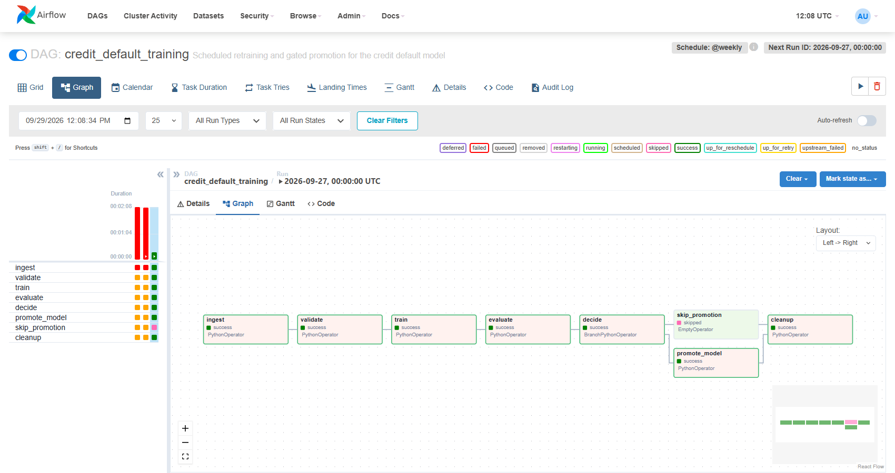
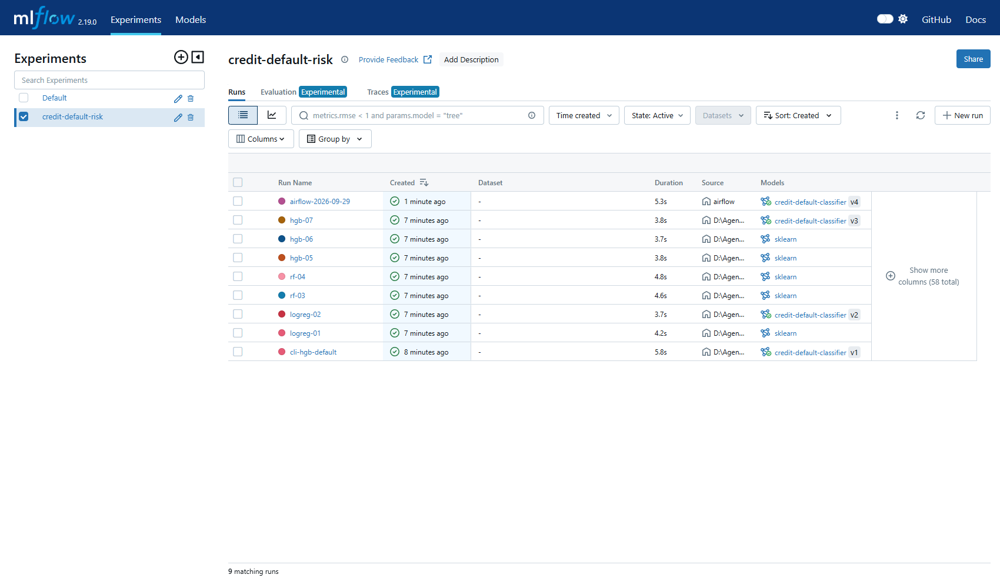
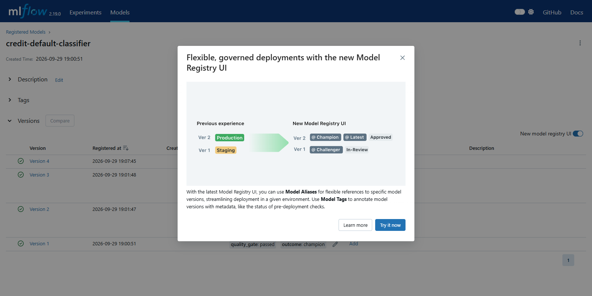

# Lab 2 Report — ML Pipeline & Experiment Tracking

DDM501 · AI in DevOps, DataOps, MLOps · Võ Minh Sang (25MS13286)

## 1. Pipeline design

```
ingest -> validate -> train -> evaluate -> promote
```

| Stage | Module | What it owns |
|---|---|---|
| Ingest | `pipeline/data_ingestion.py` | Loading the CSV and a **seeded, stratified** 80/20 split (`random_state=501`), plus the data summary (rows, positive rate) that each run logs |
| Validate | `pipeline/validation.py` | Three levels, each returning a list of errors. **Schema**: 23 features and the target are present and numeric. **Statistics**: at least 5,000 rows, at most 2% missing per column, positive rate within [5%, 60%]. **Semantics**: SEX/EDUCATION/MARRIAGE codes, LIMIT_BAL, AGE and PAY_* ranges, no negative PAY_AMT. The orchestrator collects all three levels and raises `DataValidationError` |
| Train | `pipeline/preprocessing.py`, `pipeline/training.py` | Six derived features (utilisation, payment ratio, max delay, months delayed, average bill, average payment), an unfitted `ColumnTransformer` (one-hot with `handle_unknown="ignore"`; median impute and scale), then the estimator, all inside one sklearn `Pipeline` and one MLflow run |
| Evaluate | `pipeline/evaluation.py` | ROC AUC and PR AUC from probabilities; precision, recall and F1 from labels at threshold 0.30; Brier score; confusion counts; the same metrics per SEX group; fairness gap = the largest selection-rate difference |
| Promote | `pipeline/registry.py` | `promote_model` registers **every run it is given**, including one that fails the gate (tagged `rejected`, no alias). The CLI runner always calls it; in the DAG, `decide` sends a failed gate to `skip_promotion` ("do nothing", as the lab specifies), so a rejected DAG run is not registered and its reasons stay in the `quality_gate` XCom. The quality gate is ROC AUC ≥ 0.70, PR AUC ≥ 0.45 and gap ≤ 0.10; a missing metric fails the gate. The run becomes `@champion` if it beats the current champion by 0.002 AUC, `@challenger` if it passes but does not, and is tagged `rejected` if it fails |

**Why validation sits right before training rather than straight after ingestion.** Ingestion only proves the
file could be read. The step that can do damage is training followed by promotion. If an upstream extract breaks
and every label is 0, training still succeeds and produces a model with about 77% accuracy that approves everyone.
Placing the gate on the edge into training means that *no model can exist* for data that failed a check. In the DAG,
`validate` raising marks the task failed, and `train`, being downstream, never runs. The report is also logged into the
MLflow run (`validation_report.json`, tag `data_validation=passed`). A model therefore carries the evidence that its
data was checked.

Two details that tests enforce: `add_derived_features` returns a **copy** (the caller's frame is never widened), and
it divides by `LIMIT_BAL.replace(0, np.nan)`, so a zero limit becomes an honest NaN that the imputer handles instead of an
`inf` that silently poisons the scaler.

## 2. Experiment analysis

`python -m experiments.run_experiments`: seven configurations across three families. The table also includes the
single pipeline run (`unleashed-sni…`, HGB with default parameters). Full results are in
[`docs/results/leaderboard.txt`](docs/results/leaderboard.txt) and
[`docs/results/sweep_results.json`](docs/results/sweep_results.json).

| Run | Model | ROC AUC | PR AUC | Recall @0.30 | Fairness gap | Gate |
|---|---|---:|---:|---:|---:|---|
| logreg-01 | LogReg C=0.1 | **0.7511** | **0.5534** | **0.507** | 0.0558 | pass |
| logreg-02 | LogReg C=1.0 | **0.7511** | **0.5534** | **0.507** | 0.0544 | pass |
| rf-04 | RF 300 trees, depth 12 | 0.7502 | 0.5406 | 0.486 | 0.0352 | pass |
| hgb-05 | HGB 200 iter, lr 0.10, depth 4 | 0.7486 | 0.5468 | 0.483 | 0.0368 | pass |
| rf-03 | RF 200 trees, depth 8 | 0.7482 | 0.5393 | 0.483 | 0.0324 | pass |
| **hgb-07** | HGB 500 iter, lr 0.03, depth 8, L2 2.0 | 0.7475 | 0.5435 | 0.485 | **0.0276** | pass |
| hgb-06 | HGB 300 iter, lr 0.06, depth 6 | 0.7473 | 0.5444 | 0.482 | 0.0306 | pass |

What the sweep told us, beyond "logistic regression won":

1. **The spread in AUC is 0.004, which is noise.** With 6,000 test rows the standard error of AUC is about 0.007. The
   leaderboard ranks models that the data cannot tell apart on accuracy, so AUC alone cannot decide the promotion.
2. **Accuracy and fairness pull in opposite directions.** The family with the best AUC (logistic regression) has
   the *widest* selection-rate gap (0.054–0.056). Every tree ensemble roughly halves it (0.028–0.037). This matches
   the lab's expectation.
3. **Regularisation does nothing for logistic regression** (C=0.1 and C=1.0 give identical AUC). With 24,000 rows
   and 29 features the linear model is nowhere near overfitting. The engineered features carry the signal.
4. **Slower, more regularised boosting (hgb-07) gives the fairest model** at essentially the same AUC as the default
   HGB (0.7475 against 0.7473).
5. **All seven pass the gate.** The 0.10 fairness threshold is loose enough that the gate does not make this
   decision for us. It exists to catch a model like an "accurate but unfair" candidate with gap 0.40, and
   `test_accurate_but_unfair_model_is_rejected` proves that it does.

## 3. The promotion decision

**I would promote `hgb-07` (HistGradientBoosting, 500 iterations, learning rate 0.03, depth 8, L2 2.0) as
`@champion`, and keep `logreg-02` as `@challenger`.**

- It gives up 0.0036 AUC (well inside the noise) to **halve the selection-rate gap** between the two SEX groups
  (0.028 against 0.054). The gap is the metric a regulator and the customer care about. The AUC difference cannot be
  distinguished from the random seed.
- Its precision and recall at the business threshold (0.30) are the same as logistic regression's within about
  0.02, so the manual review workload does not change.
- Tree models give SHAP TreeExplainer explanations for adverse-action notices (used in Lab 4).

**What to do about the trade-off rather than just picking a side:**

- **Tighten the gate instead of arguing case by case.** Tightening `MAX_FAIRNESS_GAP` from 0.10 to 0.05 would make
  this choice automatic and repeatable: logistic regression would be rejected and every tree model would pass. That is
  a policy decision for the risk owner, not something to hard-code, so it stays an environment variable.
- **Keep the challenger.** If a future retrain of logistic regression beats the champion by more than the 0.002 margin
  *and* passes a tighter fairness gate, it should win.
- **Monitor the gap in production** (Lab 4 `ml_fairness_gap`). The offline gap measures the test set, while the
  production gap measures who actually applies.

**How the decision is recorded in the registry** (`scripts/promote_decision.py`, run against the Docker MLflow
server). Both candidates first go through the normal `promote_model`, so they are registered, gated and tagged
exactly like an automated promotion. The gate alone made `logreg-02` champion (v2), because it beat the first HGB run
(v1) by more than 0.002 AUC. The final alias move is then made by hand and tagged `promotion_reason`:

| Version | Run | ROC AUC | Gate outcome | Alias now |
|---|---|---:|---|---|
| v1 | cli-hgb-default | 0.7473 | champion (first model) | — |
| v2 | logreg-02 | 0.7511 | champion | — |
| v3 | **hgb-07** | 0.7475 | challenger → **moved to champion by review** | **@champion** |
| v4 | airflow-2026-09-29 (DAG run) | 0.7473 | challenger (did not beat v3 by 0.002) | **@challenger** |

The weekly DAG run afterwards shows the margin working. Its HGB model (0.7473) passed the gate but did not beat
the champion by 0.002, so it became `@challenger` and production was left untouched.

## 4. Orchestration

`dags/credit_training_dag.py`:

```
ingest -> validate -> train -> evaluate -> decide -> [promote_model | skip_promotion] -> cleanup
```

- Every task calls a function from `pipeline/`. The DAG orchestrates and never reimplements, so the scheduled model
  and the tested model are produced by the same code.
- **What travels through XCom:** `run_dir` (a path), `data_stats` (a dict of scalars), `validation_report`
  (small), `mlflow_run_id`, `metrics` (**scalars only**), `quality_gate` and `promotion` (name, version, outcome).
- **What does not:** the raw frame (`raw.parquet`), the train/test split (`split.joblib`), the fitted model
  (`model.joblib`) and the full evaluation with per-group metrics (`evaluation.json`). These go to the shared volume
  `/opt/airflow/artifacts/<run_id>/`. XCom values are serialised into the Airflow metadata database with a size limit.
  A DataFrame or model does not belong there, and a nested dict of group metrics is how people discover that limit.
- `decide` is a `BranchPythonOperator` that returns the **task_id** `"promote_model"` or `"skip_promotion"`.
- `cleanup` uses `trigger_rule="none_failed_min_one_success"`. With the default `all_success`, the skipped branch
  would make cleanup skip too, and the run directory would leak on every run.
- The Airflow image (`docker/airflow.Dockerfile`) installs as the `airflow` user with Airflow 2.8.4's constraints
  file, and sets `PYTHONPATH=/opt/airflow/project`. MLflow runs as its own service with
  `sqlite:////mlflow/mlflow.db` (four slashes, an absolute path on a named volume, so history survives restarts).

### Evidence

A successful DAG run. `decide` chose `promote_model`, so `skip_promotion` is **skipped** (pink) and `cleanup` still
ran because of its trigger rule. The two red runs on the left failed before the compose fix described below.



MLflow tracking server: the sweep, the CLI run and the Airflow run, with their registered versions.





### Two fixes needed to make the provided stack run

1. **MLflow artifacts.** With `--default-artifact-root /mlflow/artifacts`, every client (the Airflow containers, the
   host) writes artifacts to *its own* local `/mlflow/artifacts`, and registered models point at files the server
   never received. The server now proxies artifacts: `--default-artifact-root mlflow-artifacts:/
   --artifacts-destination /mlflow/artifacts --serve-artifacts`.
2. **Writable project directories.** `pipeline/config.py` creates `models/` and `artifacts/` under the project root
   when it is imported. `/opt/airflow/project` is owned by root in the image, so `ingest` failed with
   `PermissionError`. Both directories are now mounted from the host.

## 5. Reproducibility

To rebuild the best run from what was logged:

1. **Code:** check out the commit of the run (tag it, for example `git tag v1.0-hgb07`).
2. **Data:** `data/credit_default.csv` is committed. The run logs `data_n_rows=30000` and
   `data_positive_rate=0.2328`, which identify it, and a changed file would change both.
3. **Split:** `RANDOM_STATE=501` is logged as a parameter. `split_data` is stratified and seeded, and
   `test_split_is_reproducible` asserts that it gives the same indices twice.
4. **Parameters:** every hyperparameter is an MLflow param
   (`model_type=hgb, max_iter=500, learning_rate=0.03, max_depth=8, l2_regularization=2.0`).
5. **Feature contract:** `feature_columns.json` lists the 29 columns the model expects. The logged model also has a
   signature and an input example.
6. **Environment:** `requirements.txt` pins scikit-learn 1.6.0 and MLflow 2.19.0, the same in the Airflow image.
7. **Rerun:**
   ```bash
   python -m pipeline.run_pipeline --model-type hgb --max-iter 500 --learning-rate 0.03 --max-depth 8 --l2-regularization 2.0 --no-register
   ```
   This reproduces the metrics exactly. The Assignment 2 matrix reran the shared configurations independently and
   matched to four decimal places.
